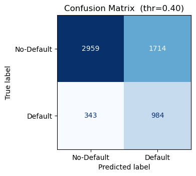
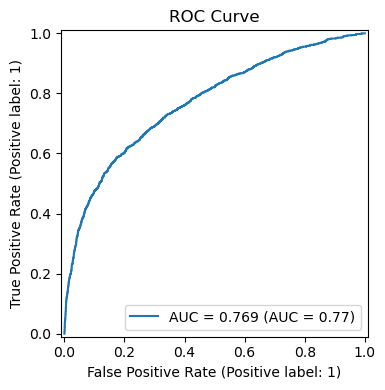

# Credit Card Default Risk Prediction API (Taiwan)

---

## 📋 Table of Contents

- [Project Overview](#-project-overview)
- [Features](#-features)
- [Tech Stack & Tools](#%EF%B8%8F-tech-stack--tools)
- [Repository Structure](#-repository-structure)
- [Dataset](#-dataset)
- [Model Training Pipeline](#-model-training-pipeline)
- [API Service & Deployment](#-api-service--deployment)
- [Running Locally](#%EF%B8%8F-running-locally)
- [Deploying on Render (Cloud)](#%EF%B8%8F-deploying-on-render-cloud)
- [Testing & CI/CD](#-testing--cicd)
- [API Usage Guide](#-api-usage-guide)
- [Project Impact & Benefits](#-project-impact--benefits)
- [Final Model Evaluation](#-final-model-evaluation)
- [License](#-license)
- [Citation](#-citation)

---

## 📝 Project Overview

This project delivers a **machine learning solution for predicting credit card default risk**, covering all stages from data processing, feature engineering, model training to scalable API deployment.  
The final product is a **FastAPI RESTful web service**, which supports real-time inference via a public cloud endpoint, containerized via Docker, and auto-deployed on Render.

> 🔐 **Note:** A live version of this credit default prediction API is deployed on Render and ready for use. However, to prevent misuse and to better control access, the API endpoint is not publicly listed. If you are interested in testing or integrating with the model, feel free to contact me directly to request the API URL and access key.

---

## 🌟 Features

- **Modularized code for data preparation and feature engineering**
- **High-performance ML model (LightGBM + EasyEnsemble)**
- **Automated training script with MLflow for experiment tracking (local/dev)**
- **Production-ready FastAPI REST API with Pydantic input validation**
- **One-click deployment on Render (Cloud PaaS with free tier)**
- **CI/CD integration (GitHub Actions): automated testing, linting, deployment**
- **API Key authentication supported for secure access**

---

## 🛠️ Tech Stack & Tools

- **Language/Frameworks:** Python 3.11, FastAPI, Pydantic, Uvicorn
- **Machine Learning:** LightGBM, scikit-learn, imblearn
- **Model Packaging:** joblib, MLflow (for development)
- **Data Processing:** Pandas, NumPy
- **API Deployment:** Docker, Render (free public cloud)
- **Experiment Tracking:** MLflow (local, optional)
- **Automation:** GitHub Actions (CI/CD), pytest (unit testing), flake8 (static analysis)
- **Version Control:** Git, GitHub

---

## 📂 Repository Structure

```text
credit-default-taiwan/
│
├── notebooks/                  # Jupyter notebooks for experiments
│   └── Credit_Default_Risk.ipynb
├── src/                        # Data and feature engineering modules
│   ├── __init__.py
│   ├── data_prep.py
│   ├── feature_eng.py
│   ├── model_utils.py
│   └── train.py
├── artifacts/                  # Trained model artifacts
│   └── model.joblib
├── api/                        # FastAPI service code
│   ├── app.py
│   └── schema.py
├── test/                       # Unit tests
│   └── test_app.py
├── requirements.txt            # Main project dependencies
├── requirements-dev.txt        # Dev/test dependencies
├── Dockerfile                  # Docker build recipe
├── .dockerignore
├── .gitignore
├── .flake8                     # flake8 configuration
├── README.md                   # (this file)
└── LICENSE                     # License info
```

---

## 📑 Dataset

- **Source:** [UCI Credit Card Default Dataset](https://archive.ics.uci.edu/ml/datasets/default+of+credit+card+clients)
- **Samples:** 30,000 entries
- **Features:** 23 columns (including demographics, balance, billing, and payment records)
- **Goal:** Predict whether a client will default on payment next month

---

## 🚀 Model Training Pipeline

1. **Data Cleaning & Preparation** (`src/data_prep.py`)
   - Handling missing values
   - Categorical encoding
   - Outlier and extreme value treatment

2. **Feature Engineering** (`src/feature_eng.py`)
   - Generating derived features
   - Standardization, binning, and other transformations

3. **Model Training** (`src/model_utils.py`, `src/train.py`)
   - LightGBM with EasyEnsemble for imbalanced classification
   - Evaluation using accuracy, AUC, recall, and other metrics
   - Exporting the final pipeline to `artifacts/model.joblib`

4. **MLflow Experiment Tracking**
   - *Optional*: Only for local development and experiment tracking

---

## 🌐 API Service & Deployment

- **Framework**: FastAPI
- **Inference**: Loads model directly from `artifacts/model.joblib`
- **Input Validation**: Handled with Pydantic schema
- **Security**: API Key authentication supported (customizable)

### 🔌 Main Endpoints

- `GET /`  
  - Health check endpoint to confirm the service is live.

- `POST /predict`  
  - Accepts a batch of client records in JSON format.  
  - Returns prediction results with probability scores and binary labels.

---

## 🖥️ Running Locally

### 1. Install dependencies

```bash
git clone https://github.com/hungchenhsu/credit-default-taiwan.git
cd credit-default-taiwan
python -m venv venv
source venv/bin/activate  # On Windows use: venv\Scripts\activate
pip install -r requirements.txt
```

### 2. Train the model

```bash
python src/train.py
# Output: artifacts/model.joblib
```

### 3. Launch the API server

```bash
uvicorn api.app:app --host 0.0.0.0 --port 8000
```

### 4. Example API call

```bash
curl -X POST http://127.0.0.1:8000/predict \
  -H "Content-Type: application/json" \
  -d '{
        "records": [{
          "LIMIT_BAL": 200000,
          "SEX": 2,
          "EDUCATION": 2,
          "MARRIAGE": 1,
          "AGE": 29,
          "PAY_0": 1,  "PAY_2": 0, "PAY_3": 0,
          "PAY_4": 0,  "PAY_5": 0, "PAY_6": 0,
          "BILL_AMT1": 3913, "BILL_AMT2": 3102, "BILL_AMT3": 689,
          "BILL_AMT4": 0,    "BILL_AMT5": 0,    "BILL_AMT6": 0,
          "PAY_AMT1": 0, "PAY_AMT2": 1000, "PAY_AMT3": 1000,
          "PAY_AMT4": 1000, "PAY_AMT5": 0, "PAY_AMT6": 0
        }]
      }'
```

---

## ☁️ Deploying on Render (Cloud)

### 1. Sign up and log in to Render
Visit [https://render.com](https://render.com) and sign up for an account if you don't already have one.

### 2. Create a New Web Service
- Choose **"From a Git repository"**
- Connect your **GitHub** account and select this repository
- Configure the service:
  - **Build Command**:  
    ```bash
    pip install -r requirements.txt
    ```
  - **Start Command**:  
    ```bash
    uvicorn api.app:app --host 0.0.0.0 --port 8000
    ```
  - **Environment Variables**:  
    Add necessary environment variables like:
    ```
    API_KEY = your-secure-api-key
    ```

- **Render Free Plan**:  
  - 750 hours per month included for web services.

### 3. After Deployment
Once deployed, Render will provide a public URL.

---

## 🧪 Testing & CI/CD

- **`pytest`** for unit testing  
  All tests are located in [`test/test_app.py`](test/test_app.py) to ensure API functionality and code stability.

- **`flake8` / `black`** for linting and code formatting  
  Ensures code follows consistent style and best practices.

- **GitHub Actions**  
  Automatically triggered on every `push` or `pull request`. It performs:
  - Dependency installation
  - Linting and style checks
  - Running unit tests (`pytest`)
  - Optional deployment to Render (if configured)

- **Development dependencies**  
  All dev tools are listed in [`requirements-dev.txt`](requirements-dev.txt) and include:

---

## 📚 API Usage Guide

### 🔹 Input Format

Send a `POST` request to `/predict` with a JSON body like the following:

```json
{
  "records": [
    {
      "LIMIT_BAL": 200000,
      "SEX": 2,
      "EDUCATION": 2,
      "MARRIAGE": 1,
      "AGE": 29,
      "PAY_0": 1,  "PAY_2": 0, "PAY_3": 0,
      "PAY_4": 0,  "PAY_5": 0, "PAY_6": 0,
      "BILL_AMT1": 3913, "BILL_AMT2": 3102, "BILL_AMT3": 689,
      "BILL_AMT4": 0,    "BILL_AMT5": 0,    "BILL_AMT6": 0,
      "PAY_AMT1": 0, "PAY_AMT2": 1000, "PAY_AMT3": 1000,
      "PAY_AMT4": 1000, "PAY_AMT5": 0, "PAY_AMT6": 0
    }
  ]
}
```

### 🔸 Output Format

A list of predictions, each including:
- `probability`: the predicted probability of default
- `label`: binary classification result (1 = default, 0 = no default)

```json
[
  {
    "probability": 0.31,
    "label": 0
  }
]
```

---

## 📈 Project Impact & Benefits

- Scalable and maintainable end-to-end ML pipeline with clear modular structure
- Suitable for real-world financial risk modeling and credit scoring applications
- Public cloud API available for demonstration and external integration
- CI/CD pipelines automate testing, linting, and deployment
- Cloud deployment is cost-effective and allows seamless horizontal scaling as traffic grows

---

## 🌟 Final Model Evaluation

| Metric | Value | Interpretation |
|--------|-------|----------------|
| **ROC-AUC** | **0.769** | Overall discrimination power. In line with 0.77 – 0.78 benchmark for this public dataset. |
| **Recall (Default = 1)** | **0.742** | Captures **74%** of actual defaults which meets the business goal of high sensitivity. |
| **Precision (Default = 1)** | **0.365** | Acceptable for a 22% positive class after shifting threshold to favor recall. |
| **F1 (Default)** | **0.489** | Balanced view of P & R given the chosen threshold **0.40**. |
| **Accuracy** | **0.657** | Lower by design (recall-oriented model). |

- **Recall-first strategy** avoids missing high-risk customers; false positives can be filtered downstream. **Source:** [Paper](https://lup.lub.lu.se/luur/download?func=downloadFile&recordOId=9006336&fileOId=9006344#:~:text=relationship%20be%02tween%20precision%20and%20recall,customer%20in%20terms%20of%20lost)
- **AUC ≥ 0.75** matches peer-reviewed benchmarks on the UCI dataset. **Source:** [Paper](https://www.mdpi.com/1911-8074/18/1/23#:~:text=area%20under%20the%20ROC%20curve,for%20RF)

 


---

## 📄 License

This project is licensed under the MIT License - see the [LICENSE](LICENSE) file for details.

## 🤝 Citation

If you find this repository helpful in your research, coursework, or applied projects, please consider citing or linking back to the repository:

Hung-Chen Hsu. *Credit Default Predictor API: An End-to-End Machine Learning Pipeline for Credit Risk Assessment*. GitHub, 2025.  
Repository: [https://github.com/hungchenhsu/credit-default-taiwan](https://github.com/hungchenhsu/credit-default-taiwan)

This helps acknowledge the original work and encourages open sharing in the machine learning and financial analytics community 🙌

---

Created with 💻 and 🎯 by Hung-Chen Hsu
